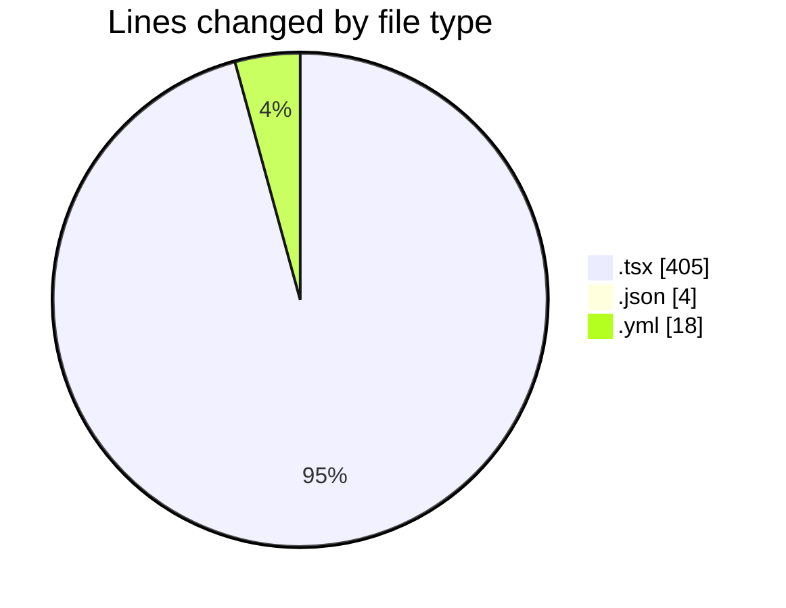
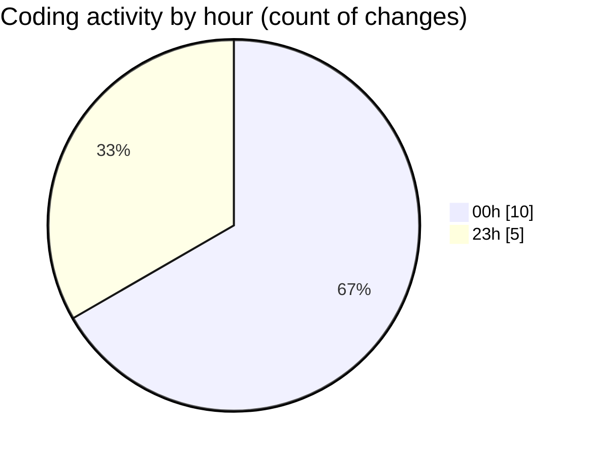

# eventscop-frontend-guide (Workspace) - Activity Summary 

## Overall Statistics

| Stat                   | Value                                                             |
| ---------------------- | ----------------------------------------------------------------- |
| **Lines Added** (➕)   | 399                                          |
| **Lines Removed** (➖) | 28                                        |
| **Net Change** (↕)    | 371                |
| **Active Time** (⌚)   | 8 minutes |

## Modified Files
- **StepContact.tsx** (+284, -1)
- **ActivityQuoteForm.tsx** (+5, -5)
- **ClientPresearchSection.tsx** (+8, -8)
- **RadiusSelector.tsx** (+3, -3)
- **fr.json** (+2, -2)
- **ConfirmationModal.tsx** (+88, -0)
- **lefthook.yml** (+9, -9)

## Visualizations

### By File Type (Lines Changed)

### By Hour (Estimated Activity Count)

> **Last Updated:** 11/27/2025, 12:10:24 AM