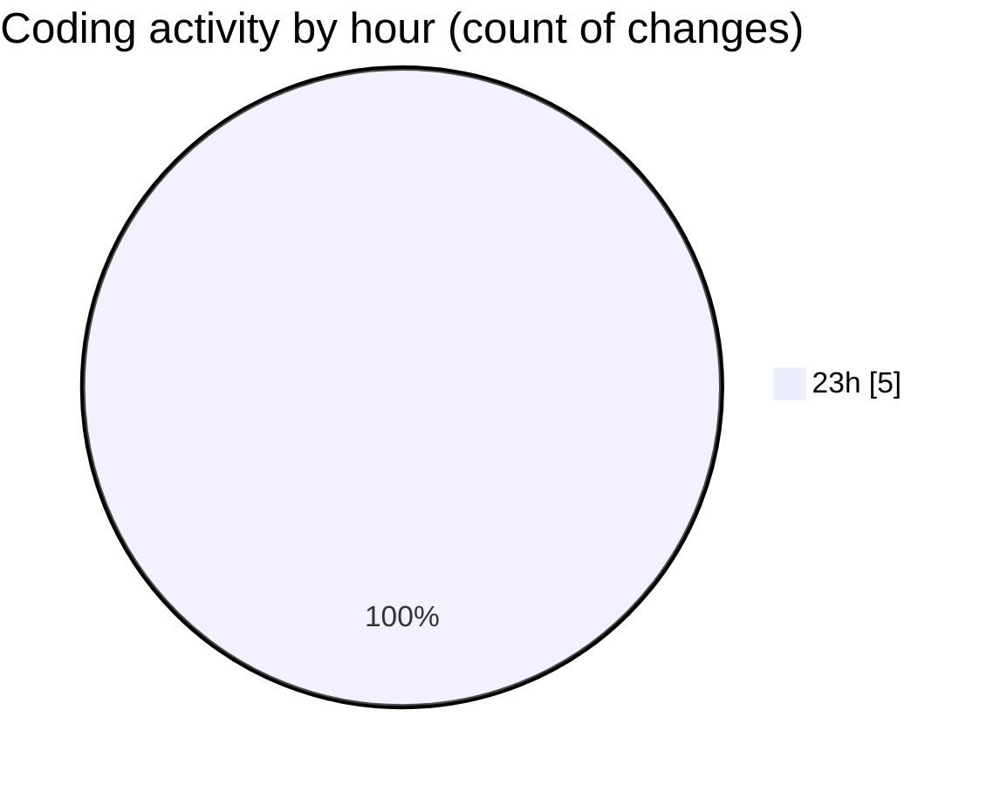

# eventscop-frontend-guide (Workspace) - Activity Summary 

## Overall Statistics

| Stat                   | Value                                                             |
| ---------------------- | ----------------------------------------------------------------- |
| **Lines Added** (➕)   | 302                                          |
| **Lines Removed** (➖) | 0                                        |
| **Net Change** (↕)    | 302                |
| **Active Time** (⌚)   | 0 minute |

## Modified Files
- **StepContact.tsx** (+284, -0)
- **ActivityQuoteForm.tsx** (+5, -0)
- **ClientPresearchSection.tsx** (+8, -0)
- **RadiusSelector.tsx** (+3, -0)
- **fr.json** (+2, -0)

## Visualizations

### By File Type (Lines Changed)

### By Hour (Estimated Activity Count)

> **Last Updated:** 11/27/2025, 12:00:24 AM