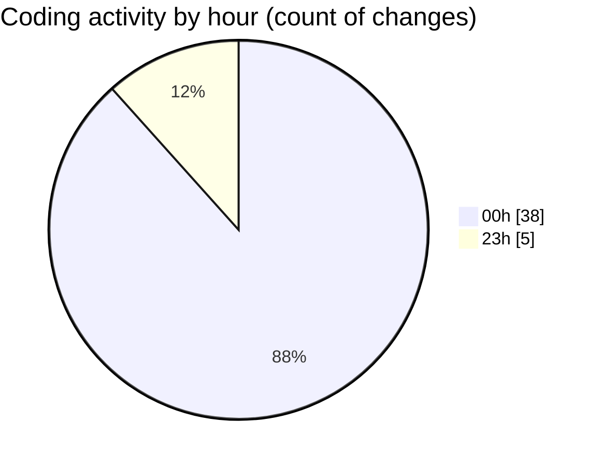

# eventscop-frontend-guide (Workspace) - Activity Summary 

## Overall Statistics

| Stat                   | Value                                                             |
| ---------------------- | ----------------------------------------------------------------- |
| **Lines Added** (➕)   | 7003                                          |
| **Lines Removed** (➖) | 54                                        |
| **Net Change** (↕)    | 6949                |
| **Active Time** (⌚)   | 40 minutes |

## Modified Files
- **StepContact.tsx** (+285, -1)
- **ActivityQuoteForm.tsx** (+10, -10)
- **ClientPresearchSection.tsx** (+16, -8)
- **RadiusSelector.tsx** (+6, -6)
- **fr.json** (+4, -4)
- **ConfirmationModal.tsx** (+88, -0)
- **lefthook.yml** (+18, -18)
- **package.json** (+7, -6)
- **useCateringGeneration.ts** (+39, -0)
- **PresearchButton.tsx** (+82, -1)
- **package.json** (+122, -0)
- **pnpm-lock.yaml** (+6326, -0)

## Visualizations

### By File Type (Lines Changed)

### By Hour (Estimated Activity Count)

> **Last Updated:** 11/27/2025, 12:55:24 AM