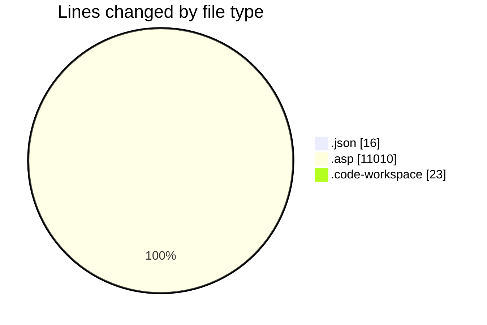
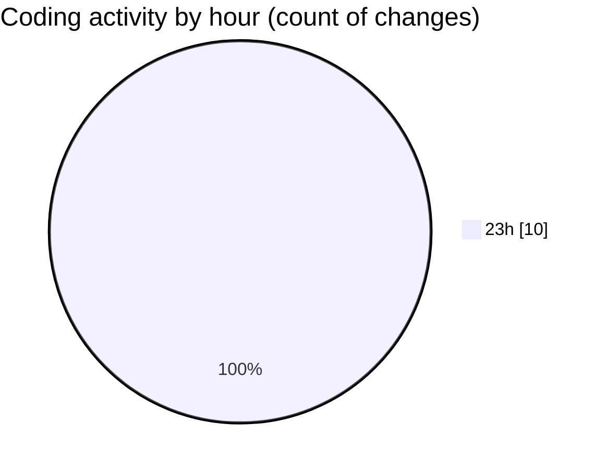

# usr.aleoudev.fr (Workspace) - Activity Summary 

## Overall Statistics

| Stat                   | Value                                                             |
| ---------------------- | ----------------------------------------------------------------- |
| **Lines Added** (➕)   | 11046                                          |
| **Lines Removed** (➖) | 3                                        |
| **Net Change** (↕)    | 11043                |
| **Active Time** (⌚)   | 10 minutes |

## Modified Files
- **settings.json** (+13, -3)
- **cli_stats.asp** (+1590, -0)
- **cli_cdc.asp** (+1263, -0)
- **usr.aleoudev.fr.code-workspace** (+23, -0)
- **cli_stats2_date.asp** (+1705, -0)
- **cli_stats.asp** (+1944, -0)
- **async_export.asp** (+322, -0)
- **frs_demande.asp** (+2387, -0)
- **frs_demandes.asp** (+1799, -0)

## Visualizations

### By File Type (Lines Changed)

### By Hour (Estimated Activity Count)

> **Last Updated:** 11/27/2025, 11:08:52 PM