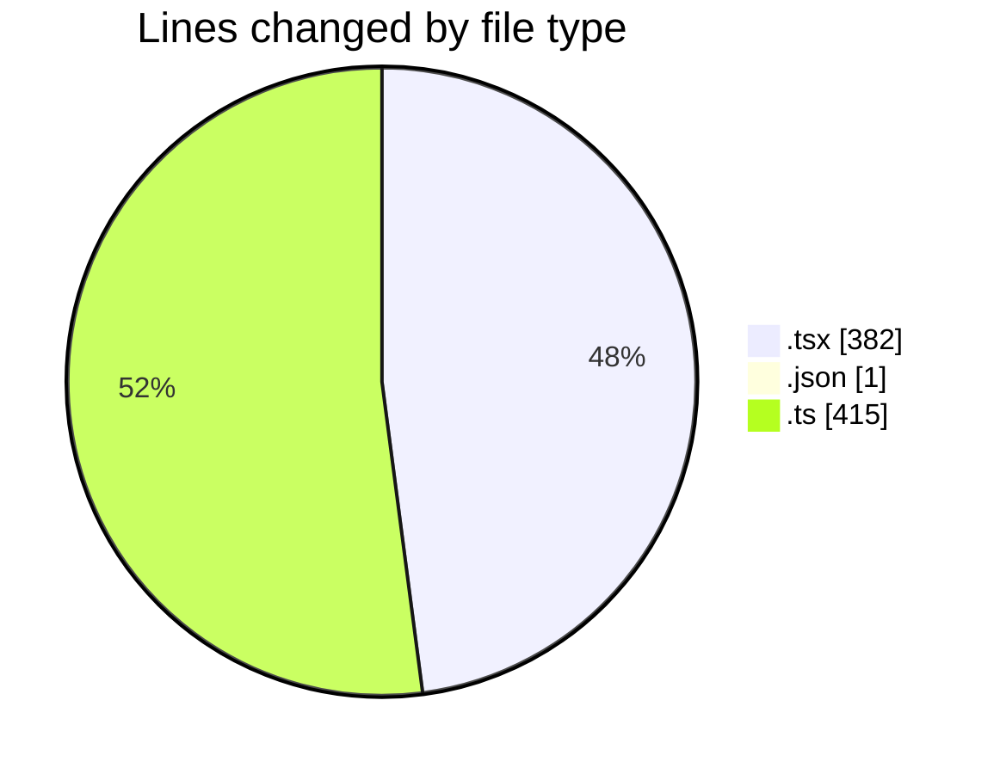
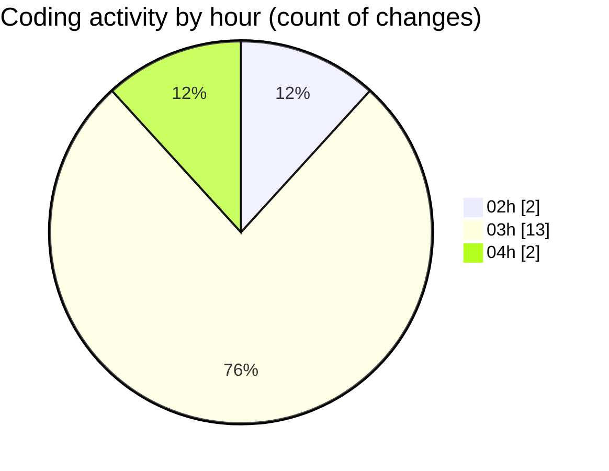

# eventscop-frontend-guide (Workspace) - Activity Summary 

## Overall Statistics

| Stat                   | Value                                                             |
| ---------------------- | ----------------------------------------------------------------- |
| **Lines Added** (➕)   | 715                                          |
| **Lines Removed** (➖) | 83                                        |
| **Net Change** (↕)    | 632                |
| **Active Time** (⌚)   | 31 minutes |

## Modified Files
- **RecapConfirmation.tsx** (+69, -5)
- **Footer.tsx** (+230, -78)
- **package.json** (+1, -0)
- **routing.ts** (+415, -0)

## Visualizations

### By File Type (Lines Changed)

### By Hour (Estimated Activity Count)

> **Last Updated:** 11/28/2025, 4:04:54 AM