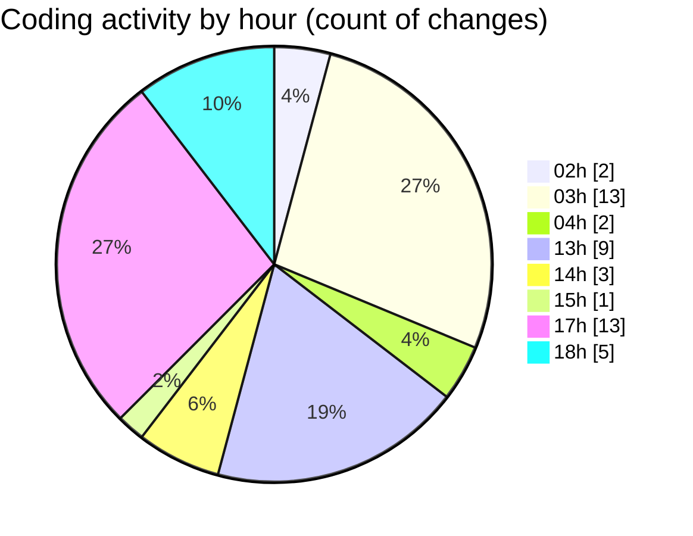

# eventscop-frontend-guide (Workspace) - Activity Summary 

## Overall Statistics

| Stat                   | Value                                                             |
| ---------------------- | ----------------------------------------------------------------- |
| **Lines Added** (➕)   | 3175                                          |
| **Lines Removed** (➖) | 168                                        |
| **Net Change** (↕)    | 3007                |
| **Active Time** (⌚)   | 56 minutes |

## Modified Files
- **RecapConfirmation.tsx** (+69, -5)
- **Footer.tsx** (+230, -78)
- **package.json** (+8, -6)
- **routing.ts** (+415, -0)
- **package.json** (+246, -0)
- **format.ts** (+18, -2)
- **lefthook.yml** (+31, -9)
- **package.json** (+2, -0)
- **fr.json** (+1994, -12)
- **review.ts** (+162, -56)

## Visualizations

### By File Type (Lines Changed)

### By Hour (Estimated Activity Count)

> **Last Updated:** 11/28/2025, 6:17:18 PM